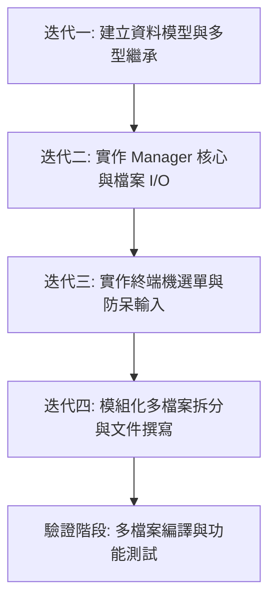

# C++ 個人簡易記帳本專題說明書 & 使用手冊 (模組化多檔案版)

本專案是一個基於 C++ 語言開發的命令列（Terminal）個人記帳應用程式，旨在提供直覺、高效的本地記帳功能。專案採用**模組化多檔案 (Multi-file)** 架構開發，深度整合了物件導向設計 (OOP) 的核心原則，包含繼承、多型與封裝，並使用 C++ 標準模板庫 (STL) 的容器與智慧指標，保障記憶體管理的安全性與程式碼的健壯性。

---

## 📂 專案檔案結構

為了提高程式碼的清晰度與維護效率，本專案已完成模組化拆分：

```text
c:\Users\STUST\Documents\w2\
├── main.cpp                # 主程式進入點，包含終端機選單與互動式操作迴圈
├── Transaction.h           # 宣告交易基礎類別 Transaction 與衍生類別 Income, Expense
├── Transaction.cpp         # 實作 Transaction、Income 與 Expense 的建構子與成員函式
├── ExpenseTracker.h        # 宣告記帳管理器類別 ExpenseTracker
├── ExpenseTracker.cpp      # 實作記帳管理器的新增、刪除、統計與檔案 I/O
├── records.txt             # 自動生成的資料存檔檔 (使用管道字元 '|' 分隔)
└── .gitignore              # 忽略編譯產出的二進位執行檔 (*.exe)
```

---

## 📖 專案規格與功能介紹

本記帳本提供以下核心操作，皆透過全中文化的終端機文字介面完成：
1. **新增「收入」項目**：輸入日期（可直接按 Enter 鍵帶入今日日期）、分類、金額（防呆校驗）與備註。
2. **新增「支出」項目**：輸入支出資訊，並自動以負數形式記錄。
3. **查看所有收支紀錄**：以對齊的表格形式輸出所有交易，並以顏色高亮標記（綠色標記收入、紅色標記支出）。
4. **刪除指定項目**：列出清單後，輸入編號（1-based）即可刪除特定項目，且會進行索引邊界防呆檢查。
5. **顯示財務摘要與餘額**：計算總收入、總支出與剩餘金額，並根據損益狀態給予警示或提醒。
6. **自動讀檔與寫檔**：啟動時自動搜尋同目錄下的 `records.txt`，並在正常退出時自動儲存。

---

## 🛠️ 物件導向設計與技術架構

本專案採用了經典的物件導向繼承架構與 STL 資源管理技術。

### 1. 類別繼承與多型 (Inheritance & Polymorphism)
*   **基礎抽象類別 `Transaction`**：定義交易的共同屬性（日期、分類、金額、備註）。聲明純虛擬函式 `getType()`、`display()` 與 `serialize()`，並提供虛擬解構子 `~Transaction()` 以防止衍生類別記憶體洩漏。
*   **衍生類別 `Income` (收入)**：繼承自 `Transaction`。實作並特化多型表現：
    *   `getType()` 回傳 `"Income"`
    *   `display()` 於終端機輸出綠色的 `[收入]` 標籤與格式化資訊
    *   `serialize()` 格式化為 `INCOME|...`
*   **衍生類別 `Expense` (支出)**：繼承自 `Transaction`。實作並特化多型表現：
    *   `getType()` 回傳 `"Expense"`
    *   `display()` 於終端機輸出紅色的 `[支出]` 標籤與格式化資訊
    *   `serialize()` 格式化為 `EXPENSE|...`

### 2. STL 類別庫與記憶體管理
*   **`std::vector`**：用於動態儲存交易記錄的陣列容器，能夠靈活支援新增與刪除操作。
*   **`std::unique_ptr`**：使用智慧指標包裝 `Transaction` 多型物件（即 `std::vector<std::unique_ptr<Transaction>>`），確保在陣列釋放、刪除元素或程式退出時，系統會自動呼叫解構子回收記憶體，完全避免了傳統 C++ 手動 `delete` 容易造成的 Memory Leak。
*   **`std::setw` 與 `std::left`**：自 `<iomanip>` 庫載入，用於精確對齊終端機的欄位寬度。

### 3. 檔案讀寫規格
系統使用 `<fstream>` 進行檔案序列化。交易紀錄以 `|` 作為分隔符號，儲存於 `records.txt` 中。
*   **寫檔格式範例**：
    ```text
    INCOME|2026-06-18|薪資|50000.000000|六月份薪水
    EXPENSE|2026-06-18|餐飲|120.000000|吃牛肉麵
    ```
*   讀檔時會自動解析各欄位，並依照第一欄的 `INCOME` 或 `EXPENSE` 動態使用 `new` 產生成員物件並包裝入智慧指標。

---

## 🚀 開發迭代流程 (Development Iteration Cycle)

本專案的開發流程分為以下四個迭代，以求品質與穩定度兼具：



1.  **第一迭代：資料模型建立**
    *   實作抽象基底類別 `Transaction`。
    *   衍生 `Income` 與 `Expense` 類別，確保虛擬解構子正確運作。
2.  **第二迭代：核心管理器與檔案讀寫**
    *   實作 `ExpenseTracker` 類別，運用 `std::vector` 及 `std::unique_ptr` 儲存多型物件。
    *   編寫 `saveToFile` 及 `loadFromFile` 讀寫資料檔。
3.  **第三迭代：文字介面與輸入安全防護**
    *   建立互動選單主迴圈，實作 `clearInputBuffer()` 解決輸入型態不符產生的崩潰問題。
    *   使用 ANSI Escape Codes 加入顏色美化（綠色收入、紅色支出）。
4.  **第四迭代：模組化多檔案重構**
    *   將單一檔案 `main.cpp` 拆解為 `Transaction`、`ExpenseTracker` 的標頭檔 (`.h`) 與實作檔 (`.cpp`)。
    *   主程式僅保留互動流程，建立高維護價值的專案目錄。

---

## 💻 編譯與執行方式

### 前提條件
*   您的電腦中必須裝有 C++ 編譯器（如 `g++`）。本專案使用 `MinGW GCC 6.3.0` 進行測試，完全相容於 C++11 規格。

### 編譯指令
打開終端機（cmd 或 PowerShell），切換至專案資料夾後，執行以下指令（需要編譯所有的 `.cpp` 檔案）：
```bash
g++ -std=c++11 main.cpp Transaction.cpp ExpenseTracker.cpp -o tracker.exe
```

### 執行程式
在終端機中執行：
```bash
.\tracker.exe
```

---

## 🛠️ 終端機 UI 操作與防呆展示

*   **輸入非數字防呆**：當在功能選單輸入字母時，程式會顯示 `[錯誤] 請輸入有效的選項數字！` 並保持選單運作，不會進入無窮迴圈。
*   **日期免輸入功能**：在新增收支時，如果不想手動輸入日期，可以直接按下 `Enter` 鍵，系統會自動擷取您電腦的當天日期作為紀錄日期。
*   **餘額摘要分析**：當總餘額小於 0 元時，系統會顯示 `(警告: 收支失衡！)` 以紅色文字高亮，提醒使用者注意財務健康。
